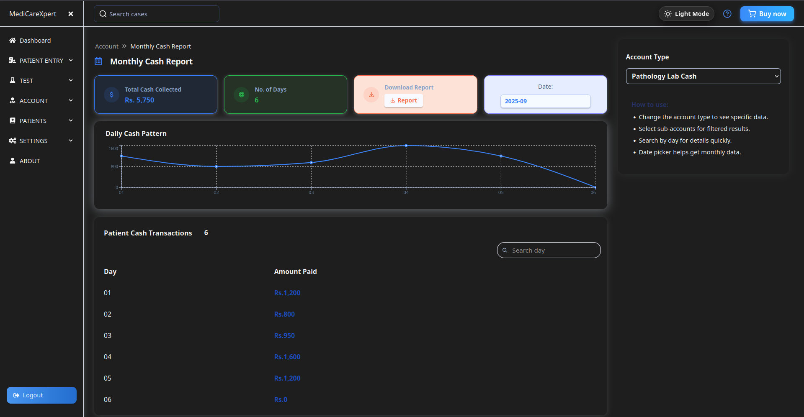

# SHEET – Medical Reports & Retail Receipts Generator

This application is designed for medical professionals to generate medical reports and for retailers to create receipts for their customers in a simple, efficient, and cross-platform way.

Live Demo: [View the App](https://fir-project-ac28e.web.app/)

## ✨ Features

#### ✔ Cross-Platform – Works on Windows, macOS, Linux, and as a Web App
#### ✔ Fast & Lightweight – Built with Tauri for minimal resource usage
#### ✔ Medical Report Creation – Simple UI for doctors to generate accurate reports
#### ✔ Retail Receipt Generator – Quick and professional receipt creation for businesses
#### ✔ Theme Toggle – Light/Dark mode support for better UX
#### ✔ Responsive Design – Mobile, Tablet & Desktop support
#### ✔ Secure & Reliable – Powered by Firebase Authentication & Firestore


## 🛠 Tech Stack

**Client:** 


**Backend & Hosting:** 


**FrameWork:**


## 📦 Installation & Setup
For Web (Development) 
``` 
# Clone the repository
git clone https://github.com/your-username/sheet.git

# Navigate to the project directory
cd sheet

# Install dependencies
npm install

# Start development server
npm run dev
```

For Tauri Desktop App
```
# Install Rust (if not installed)
curl https://sh.rustup.rs -sSf | sh

# Install dependencies for Tauri
npm install

# Run Tauri development build
npm run tauri dev
```

## Snapshot

## 🖼 Screenshots

### Light Mode


### Dark Mode



## 🧑‍💻 Author
- [@Nishant](https://www.github.com/Momking)


